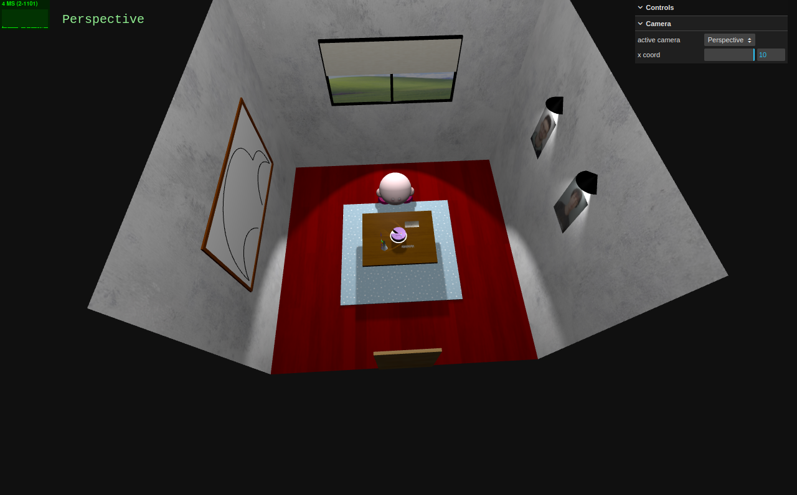
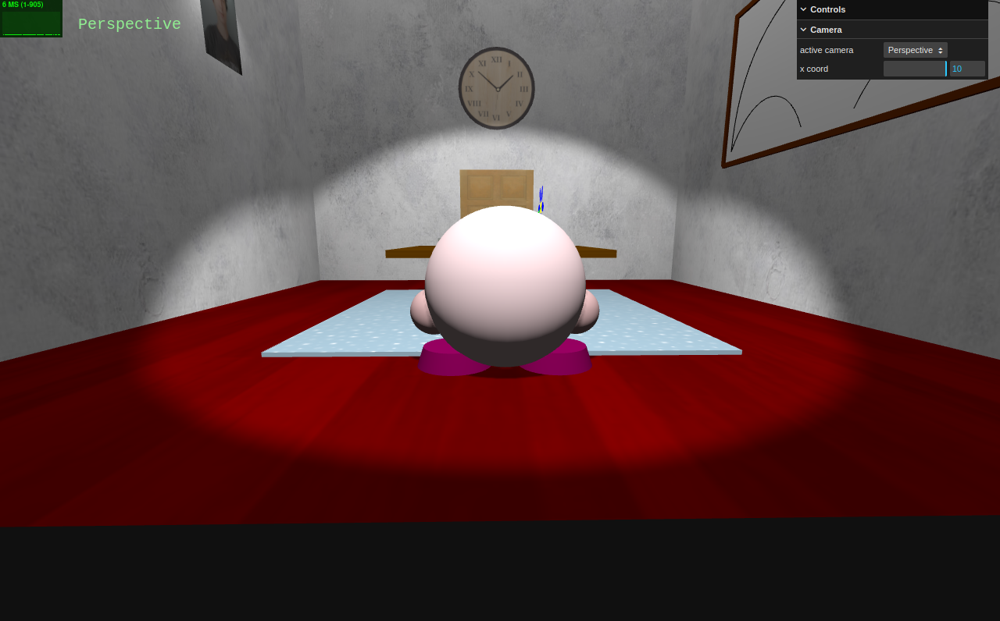
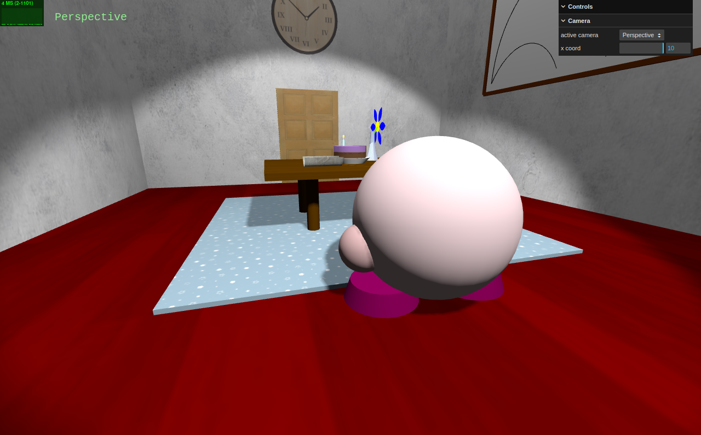

# SGI 2023/2024 - TP1

## Group: T01G01

| Name             | Number    | E-Mail             |
| ---------------- | --------- | ------------------ |
| Francisco Prada  | 202004646 | up202004646@edu.fe.up.pt |
| Vítor Cavaleiro  | 202004724 | up202004724@edu.fe.up.pt |

----
## Project information

This scene has many different details and items. Some of them are the ones referenced in the specification of the project:
- 4 walls and a floor
- a table with 4 legs
- a cake with a candle
- a spotlight from the candle that is projected into the cake and table
- a car picture
- a spring
- a flower pot with a flower on it
- a journal
- a picture of the two elements of the group
- a window

We also added some other extra elements:
- a window with borders, a curtain, and the light projected from it
- a Kirby that casts a shadow :)
- a rug with a repeated texture that receives shadows (from the kirby and table)
- two spotlights above the  pictures of the elements of the group
- a border for the car picture
- both walls and floor with textures
- a door with a texture
- a circle that imitates a clock with its texture
- the cake has two halfs, in order to simulate a topping of some sort

----
## Issues/Problems

There was a main issue during the development: during the parts where we had to update, for example, the wrapS value using the GUI, we weren't able to render the updated texture.
