# SGI 2023/2024 - TP3

## Group: T01G01

| Name             | Number    | E-Mail             |
| ---------------- | --------- | ------------------ |
| Francisco Prada  | 202004646 | up202004646@edu.fe.up.pt |
| Vítor Cavaleiro  | 202004724 | up202004724@edu.fe.up.pt |

----
## Project information

- In this project, we created a 3d fantasy racing game based on the mechanics of the famous game Mario Kart but
with Final Fantasy’s VII themes. The The user is first greeted with a menu where he inputs his name and chooses the character he wants to play with. After that, the user is taken to the game scene where he can race against another character. The game consists of 3 laps and the user can control the character with the keys (WASD). The user can also pause the game by pressing the spacebar or return to the meny by pressing escape. When the game is over, the user is taken to the game over scene where he can see his time, the result of the match and the dificulty.

## Game elements

- The game's track is closed curve defined by multiple control points and the material applies a texture. When the user leaves the track the car slows down.
- The game has a single car model and two different characters. The models are loaded with using GLTFLoader and they were modified in blender. The car wheels are animated based on the car's speed and trajectory. Characters have different stats and the user can choose which one he prefers to race with.
- The track is populated by power-ups and obstacles. The power-ups are randomly generated and the user can collect them by driving over them. The obstacles are also initially randomly generated but when a power up is selected the user needs to place a new obstacle on the track. Power-ups have two different effects(speed boost and decrease timer), Obstacles also come in the same two types but with opposite effects. The user can only have one power-up and one obstacle at a time.
- The game's information is display on a hud and on a outdoor billboard. The information displayed is speed, timer, lap, collision effect countdown. The hud also displays messages regarding the game's state.
- On the beginning of the race there is a traficc light hovering on the track, it signals the beginning of the race and the user can start driving when the lights turns green.
- The user selects the respective car as well as the competitor and the obstacles from a park belonging to the scene. The scene also has a skybox, buildings models and is built on the base created by the improved parser of TP2. The parser includes new features like displacement maps which we use to build the terrain.

## Game mechanics

The game implements the following mechanics:
**Picking**: The user can select the car, the competitor and the obstacles from the park using this mechanic. The placement of the obstacle on the track also relies on this technique.
**KeyFrame Animation**: key points were defined in order to implemnet the course of the competitor using the keyframe animation with linear interpolation. The objects also have a rotation animation and wheels animation. Diferent car models correspond to diferent animations. The speed of the animation is based on the speed of the car.
**Collision Detection**: Different objects come in contact with each other and the game reacts accordingly. The car can collide with the competitor, the obstacles and the power-ups. each object has a surrounding circunference and when the distance between the centers of two objects is smaller than the sum of their radiuses a collision is detected. On each frame, collision detection is performed and the game reacts diferrently depending on the collision with the player. obstacles and power-ups are temporarily removedand their effect is applied to the player. As for the collisison with the competitor, the player is sent on the opposite direction of the impact and is slowed down for a short period of time. The player is also restriceted to a certain area of the map.
**SpriteSheets**: In order to display text, such as in the hud, the users name or in the game over scene, we used spritesheets. The spritesheets are loaded using a predefined texture and we change the text by manipulating the uv atribute of a geometry so that we can map the specified letter.
**Shaders**: We implement shaders on the obstacle animation, by changing the visual object radius(no the actual radius used for the collisions). We tried implementing the shaders on the terrain, but we did not have any more time therefore we tried to mimic the shaders application by using the displacement map. The attempt can be confirmed on the shaders folder for the buildings.
**Particle System**: We implemented a particle system to simulate fireworks which were used on the game over scene. The particle system is composed of a group of particles which are randomly generated and have a limited lifespan. After a particle reachs the end of its lifespan it explodes in many other in a radial fashion.

## Interaction
We mentioned many interactions on these previous sections as well as the user manual, incuding picking, text input and the manipulation of the players car using (WASD) keys. Every state of the game has the functionality to reset back to the menu by pressing escape. After the race is over the user can press spacebar to restart the match. Here is a image representing an overview of the game's interaction:

<figure>
  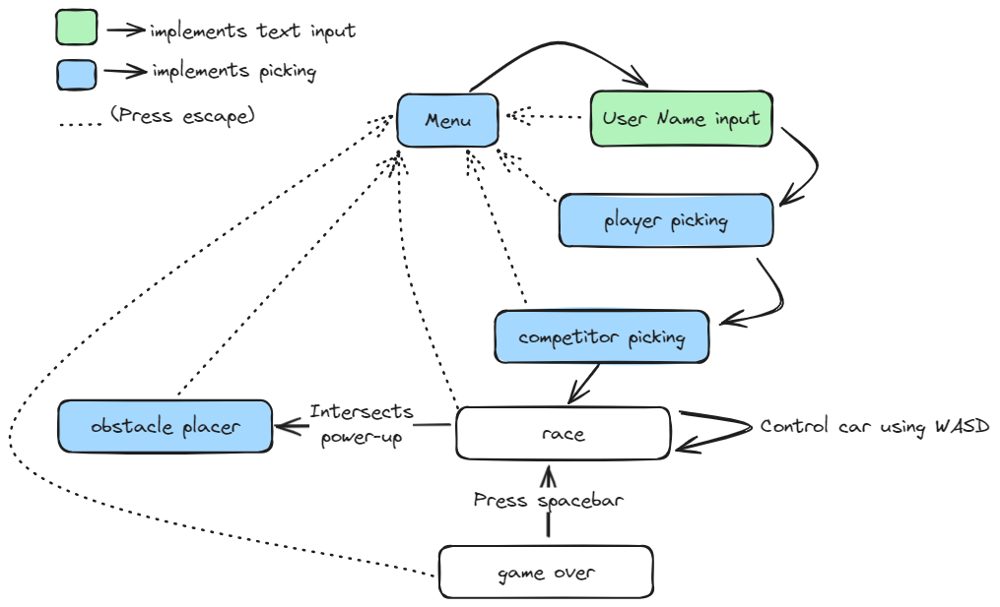
  <figcaption align="center">Fig.01 - Interaction </figcaption>
</figure>

Additional notes on visual interaction: The hud besides representing textual data, it also shows information on the players status, for instance, if the player is outside of the track, the hud will display a yellow arrow besides the speed indicator representing the slow down effect. When the player catchs a speed boost power-up, the hud will display a green arrow besides the speed indicator representing the speed boost effect. The hud also displays a timer which is used to represent the time left for the power-up or obstacle effect to end.

## Screenshots

Here is a quick recap of the of the project in the form of screenshots:
<figure>
  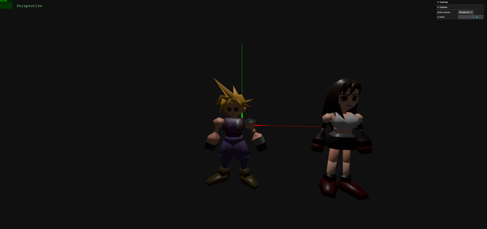
  <figcaption align="center">Fig.01 - First Version </figcaption>
</figure>

<figure>
  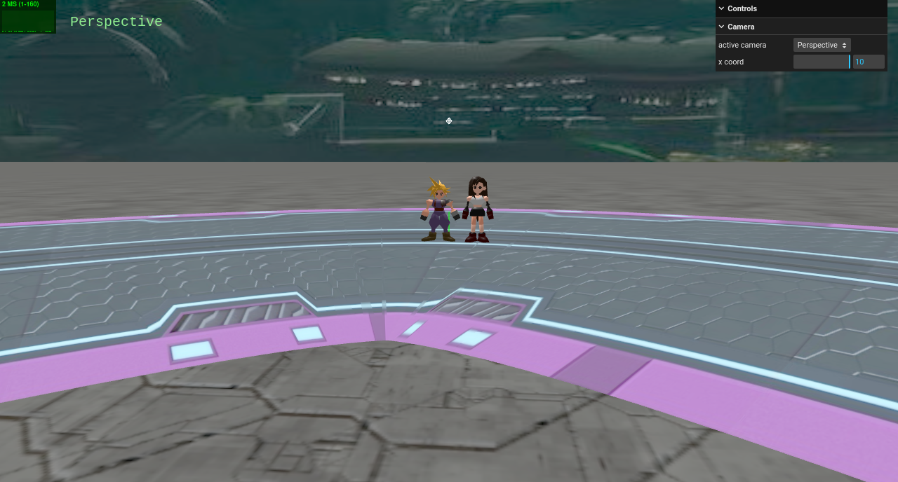
  <figcaption align="center">Fig.02 - Second Version </figcaption>
</figure>

<figure>
  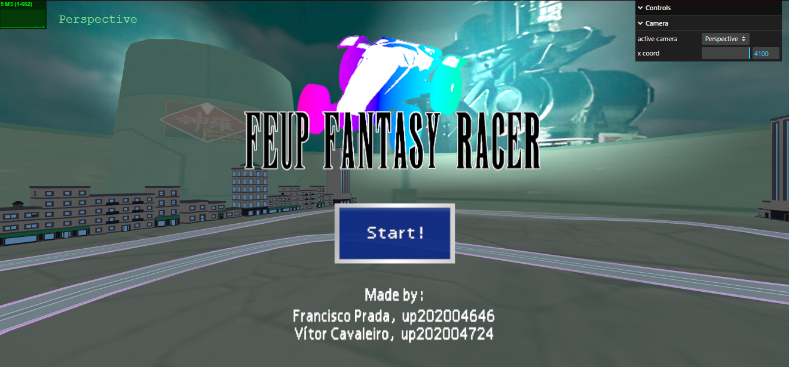
  <figcaption align="center">Fig.03 - Final Version's main menu </figcaption>
</figure>

<figure>
  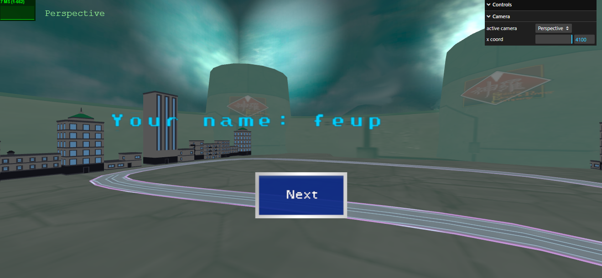
  <figcaption align="center">Fig.03 - Final Version's input menu </figcaption>
</figure>

<figure>
  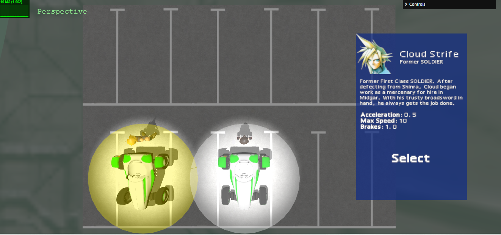
  <figcaption align="center">Fig.03 - Final Version's player's car selection </figcaption>
</figure>

<figure>
  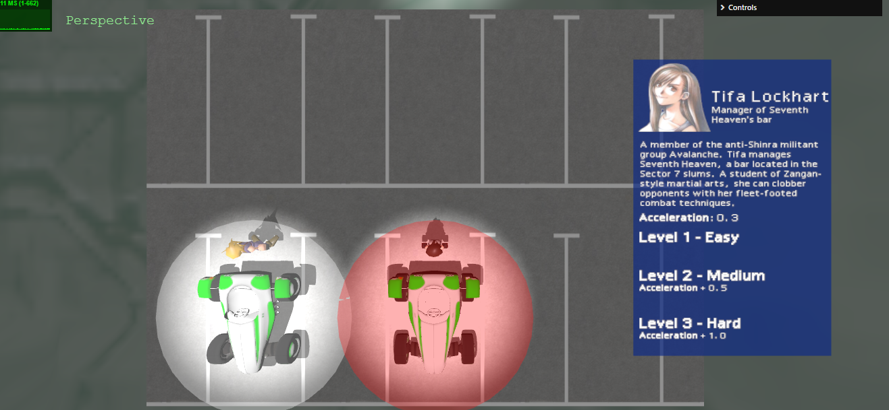
  <figcaption align="center">Fig.03 - Final Version's adversary's car selection </figcaption>
</figure>

<figure>
  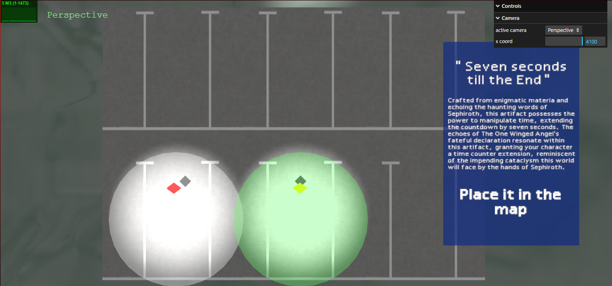
  <figcaption align="center">Fig.03 - Final Version's obstacle selection </figcaption>
</figure>

<figure>
  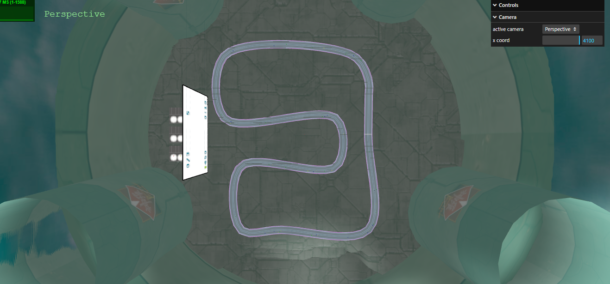
  <figcaption align="center">Fig.03 - Final Version's obstacle's placer </figcaption>
</figure>

<figure>
  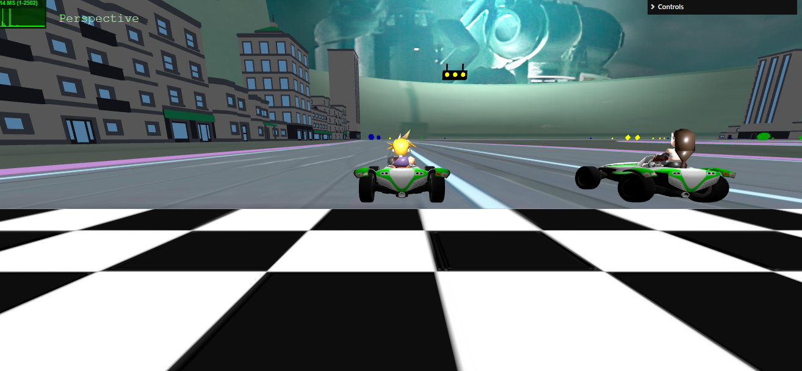
  <figcaption align="center">Fig.03 - Final Version's beginning of race </figcaption>
</figure>

<figure>
  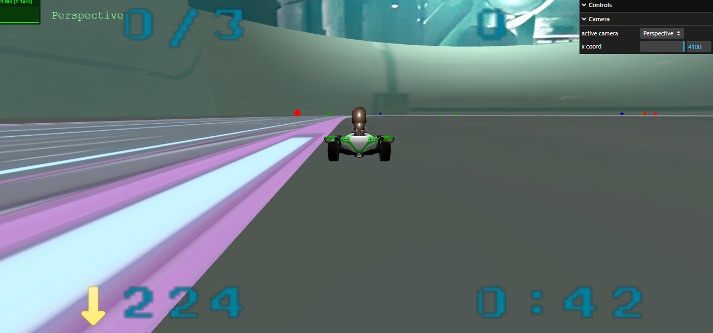
  <figcaption align="center">Fig.03 - Final Version's during the race out of the tracks </figcaption>
</figure>

<figure>
  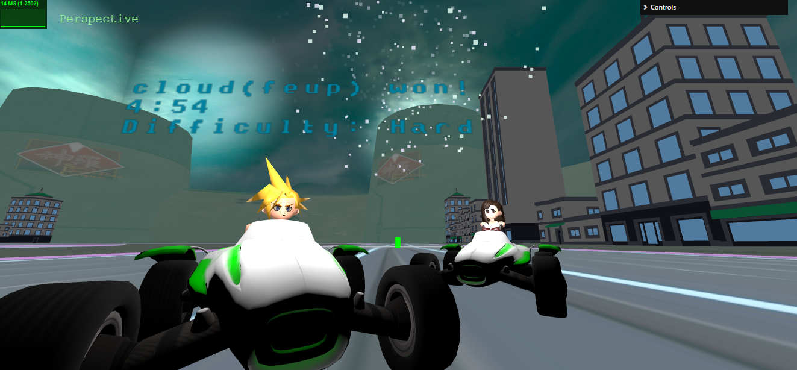
  <figcaption align="center">Fig.03 - Final Version's end of race with results </figcaption>
</figure>

## Issues/Problems

- The GUI is not as complete as we wished for: we tried to implement methods that could change the Bump Scale of certain materials (which had associated bump maps). However, this was not possible due to both time restrictions and the complexity of this process;
- Although we don't have manual mipmaps on the e XML scene, we still created methods that take care of them, in case they exist;
- It was a bit complex to implement textures texlength_s and texlength_t. However, we did it to every material that objects with a rectangle primitive, due to its simplicity in comparison to the other kinds of objects;
- Initially, we had an issue with the rotation angles: we were converting them into degrees. However, this issue has already been corrected in the final version of this project.
- Finally, to implement the sprite, we changed and added an attribute to the material descriptor so it could apply transparency to the PNG's image format. If necessary, this attribute should be removed from both the MySceneData parser and the XML file.